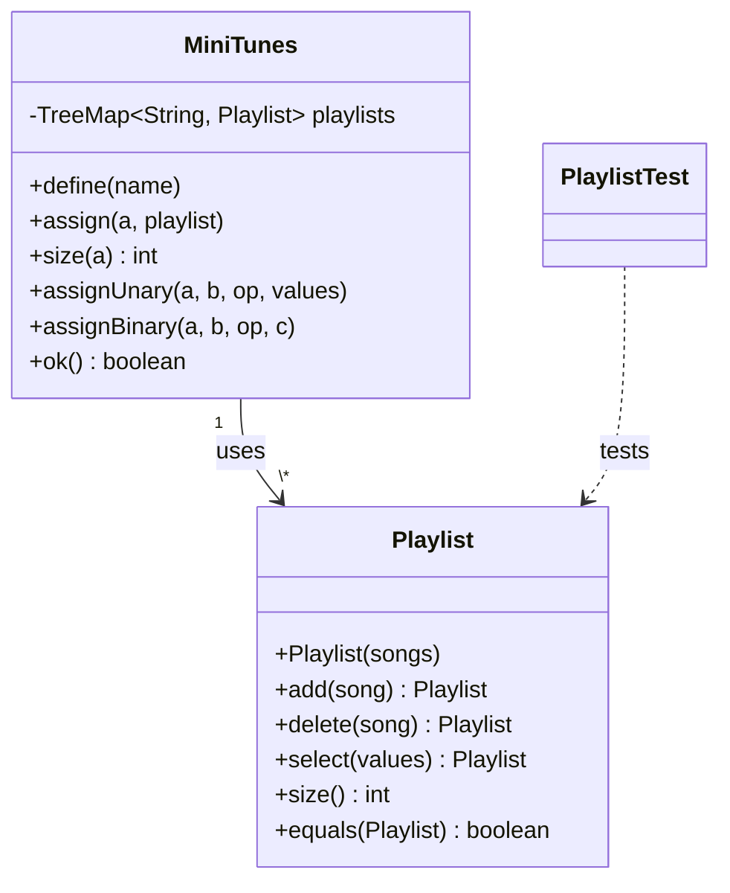

# 🎵 miniTunes

!\(https://img.shields.io/badge/Java-17-orange?logo=openjdk\&logoColor=white)
!\(https://img.shields.io/badge/JUnit-4-green?logo=junit5\&logoColor=white)
!\(https://img.shields.io/badge/IDE-BlueJ-blue)
!\(https://img.shields.io/badge/status-en%20desarrollo-yellow)

Versión simplificada de iTunes basada **únicamente en listas de reproducción**: consulta, selección, combinación y gestión de canciones bajo prácticas BDD/MDD.

\---

## 🚀 Características Clave

Desarrollo por ciclos incrementales (marca ✅ a medida que avances):

* \[ ] **Ciclo 1 — Operaciones básicas**: definir nombre de lista, asignar lista a un nombre, consultar nombres de listas, consultar canciones de una lista.
* \[ ] **Ciclo 2 — Operaciones unarias**: adicionar canción, eliminar canción, seleccionar canciones por condición.
* \[ ] **Ciclo 3 — Operaciones binarias**: unión, intersección, diferencia (preservando orden original).
* \[ ] **Ciclo 4 (bono)** — 3 operaciones nuevas definidas por el equipo.

**Reglas del dominio (`Playlist`):**

|Campo|Regla|
|-|-|
|Título / Artista|Obligatorios, únicos en combinación|
|Género|Opcional|
|Duración|1–9 minutos|
|Calificación|`\*` a `\*\*\*\*\*`|

\---

## 🛠️ Arquitectura y POO



* **`MiniTunes`**: fachada del sistema; administra las listas por nombre en un `TreeMap<String, Playlist>`.
* **`Playlist`**: colección inmutable de canciones — cada operación (`add`, `delete`, `select`) retorna una **nueva** instancia.
* **Patrón aplicado**: estilo **inmutable / fluido**, similar a Value Object — evita efectos secundarios y facilita pruebas.
* **Principios POO**: encapsulamiento de la representación interna de canciones, y responsabilidad única entre orquestación (`MiniTunes`) y dominio (`Playlist`).

\---

## ⚙️ Instalación y Ejecución

```bash
# Clonar el repositorio
git clone <url-del-repo>
cd miniTunes
```

1. Abrir el proyecto con **BlueJ**.
2. Compilar todas las clases (`Project > Compile`).
3. Crear un objeto `MiniTunes` desde el banco de objetos para probar interactivamente.

\---

## 🧪 Pruebas / Uso

Pruebas unitarias con **JUnit** sobre la clase `Playlist` (`PlaylistTest`):

```bash
# Desde BlueJ: click derecho sobre PlaylistTest > Test All
```

Ejemplo de uso esperado:

```java
Playlist pl = new Playlist(new String\[]\[] {
    {"One", "U2", "Rock", "4", "\*\*\*\*\*"},
    {"Numb", "Linkin Park", "Rock", "3", null}
});
pl.size();      // 2
pl.toString();  // listado formateado en mayúsculas
```

\---

## 👤 Autor

* **Samuel** — Escuela Colombiana de Ingeniería Julio Garavito — DOPO 2026-2

