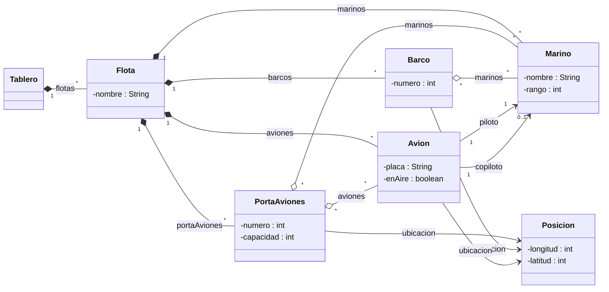

<h1 align="center">⚓ Batalla Naval</h1>

<i>Memoria, diseño y construcción — S03-S04 · DOPO 2026-2</i>

  
  
  
  

---

## 🌊 De qué va esto

Una serie de **flotas** compiten por el control de un **tablero**. Cada flota reúne
**barcos**, **portaaviones**, **aviones** y **marinos**. No todos los marinos entran
en combate: solo los que están *en turno* quedan asignados a una máquina. Toda
máquina vive en una **posición** (longitud, latitud) y varias pueden compartir la
misma casilla.

> Todos los contenedores del modelo son `ArrayList`.

**Ejemplo del enunciado** (el que usamos para validar el mapa de memoria):

| Flota | Recursos | Detalle |
|---|---|---|
| 🤍 La Gran Flota Blanca | 1 portaaviones (#100, 50% capacidad) | Aviones `HR100` y `JB100` en misión, pilotos Henry Reuterdahl y John Charles Roach. Capitán: almirante Sperry |
| 🛡️ La Gran Armada de Castilla | 1 barco (#900) + 1 avión (`PEACE`) | Marinos Pedrarias Dávila (asignado al barco 900) y Fernando Villamil (sin asignar) |

---

## 🧩 Diagrama de clases

Modelado en **Astah**; espejo en Mermaid para que se vea directo en GitHub.

---

## 🎯 Alcance del laboratorio

### I. Mapa de memoria
Representar en memoria el estado del ejemplo (dos flotas, sus máquinas, marinos y
asignaciones) — sin escribir código todavía, solo el diagrama de objetos.

### II. Atributos

| Bloque | Tarea |
|---|---|
| 🅰️ Diseñados | Redactar encabezado + atributos de `Flota` y `Tablero` |
| 🅱️ Nuevos | `código` inmutable y público por flota · `tripulantesMinimos` (fijo) y `puntaje` (editable) por portaaviones/barco/avión · tablero cuadrado, coordenadas en `[-100, 100]` |

### III. Métodos de `Flota`

Nivel de dificultad entre paréntesis (`*` = básico → `***` = alto):

| Método | Firma | Qué hace |
|---|---|---|
| `alias` (`**`) | `int alias()` | Cuenta flotas con su mismo nombre |
| `disponibilidadEnPortaaviones` (`**`) | `int disponibilidadEnPortaaviones()` | Cupo libre total en los portaaviones |
| `enAire` (`**`) | `ArrayList<String> enAire()` | Placas de aviones enemigos actualmente volando |
| `esBuenAtaque` (`***`) | `boolean esBuenAtaque(int longitud, int latitud)` | ¿La explosión da solo a enemigos, sin tocar aviones en vuelo? |
| `muevase` (`**`) | `void muevase(int deltaLongitud, int deltaLatitud)` | Desplaza todos los barcos si es posible |
| `numeroMaquinas` (`*`) | `int numeroMaquinas()` | Total de máquinas de la flota |
| `problemaEnAire` (`***`) | `boolean problemaEnAire()` | ¿Hay riesgo de confundir placas con el enemigo? |
| `suficientesMarinos` (`*`) | `boolean suficientesMarinos()` | ¿Alcanzan los marinos para tripular todo? (portaaviones 5, barco 4, avión 2) |
| `seranDestruidas` (`**`) | `ArrayList<Object> seranDestruidas(int longitud, int latitud)` | Máquinas afectadas por una explosión en agua |

> Regla del taller: nada de `get`/`set`/`is` básicos como entregable — el foco está
> en la lógica de negocio de `Flota`.

---

Ingeniería de Sistemas, Escuela Colombiana de Ingeniería Julio Garavito.

Readme generado por Claude Sonnet 5 2026
